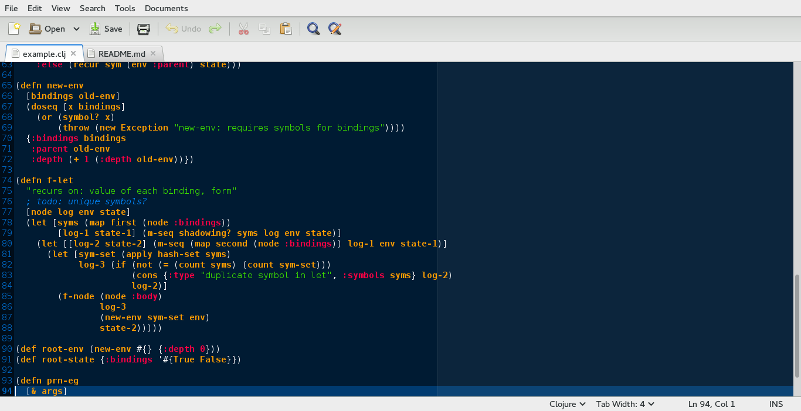

# Clojure: syntax highlighting for the gedit text editor

This project includes two separate but related language files for
Clojure syntax highlighting.

The first -- `clojure.lang` -- is very simple: it only recognizes tokens
based on their type (number, string, regex, char, symbol, keyword, comment,
and everything else).  It is based on the 
[official Clojure parser](https://github.com/clojure/clojure/blob/master/src/jvm/clojure/lang/LispReader.java).
The goal is to show the tokenization -- even when the token would later be
rejected as invalid (such as `8abc` or `\abc`).

The second -- `closure.lang` -- is intended to provide more intelligent
(and less obnoxious w.r.t. colors) feedback.  However, it's still in progress.

The syntax definitions are taken from [here](https://github.com/mattfenwick/clolint-js).

### Installation

Just put the .lang file(s) where gedit can find them.
On Fedora and CentOS, this is `/usr/share/gtksourceview-3.0/language-specs/`.

Then, open up a file in gedit with a `.clj` extension!

### Useful links

https://wiki.gnome.org/Projects/GtkSourceView

http://stackoverflow.com/questions/766775/creating-your-own-syntax-highlighting-in-gedit

https://github.com/mitko/clojure_for_gedit

http://stackoverflow.com/questions/21089486/configure-clojure-syntax-highlighting-for-gedit

def.lang for list of default styles

