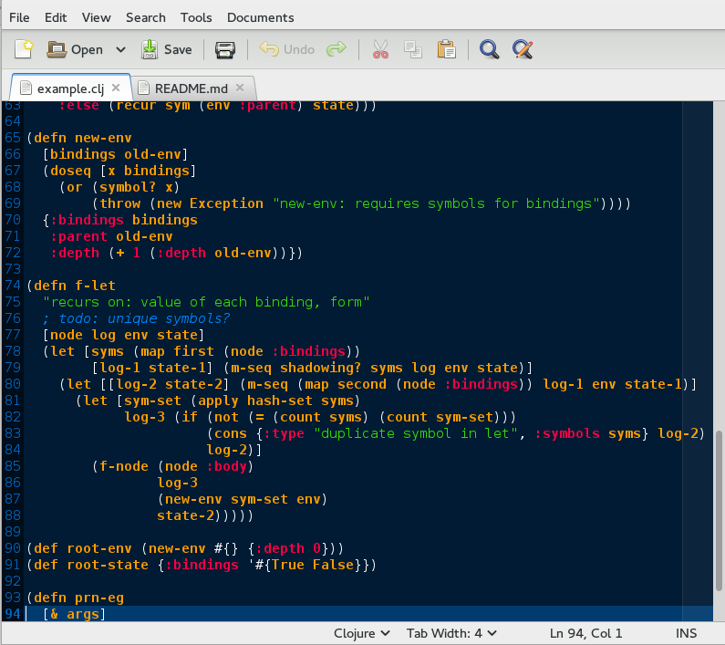

# Clojure: syntax highlighting for the gedit text editor

This project includes a language file for Clojure syntax highlighting in gedit.
It is based on the [official Clojure parser](https://github.com/clojure/clojure/blob/master/src/jvm/clojure/lang/LispReader.java).
The syntax definitions are taken from [here](https://github.com/mattfenwick/clolint-js).

### Installation

Just put the `clojure.lang` file where gedit can find them.
On Fedora and CentOS, this is `/usr/share/gtksourceview-3.0/language-specs/`.

Then, open up a file in gedit with a `.clj` extension!

### License

MIT.  Also, don't use it for evil.

### Useful links

https://wiki.gnome.org/Projects/GtkSourceView

http://stackoverflow.com/questions/766775/creating-your-own-syntax-highlighting-in-gedit

https://github.com/mitko/clojure_for_gedit

http://stackoverflow.com/questions/21089486/configure-clojure-syntax-highlighting-for-gedit

def.lang for list of default styles

